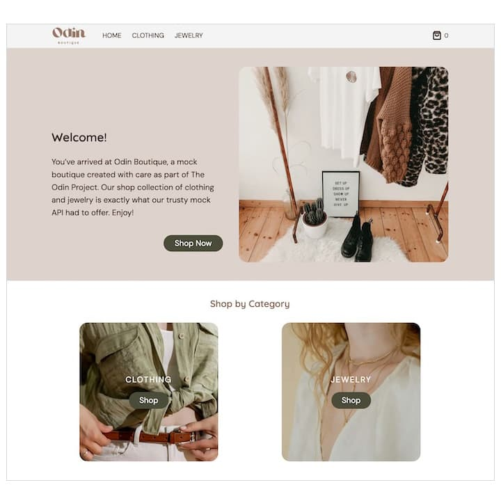

# The Odin Project: Shopping Cart

 
  

      
  

 

This **Shopping Cart** project was developed to strengthen my skills in React, focusing specially on **Testing**, **Type Checking**, **Routing**, **Data Fetching**, and **Styling**.

For more details on the project assignment, please visit [The Odin Project - Shopping Cart](https://www.theodinproject.com/lessons/node-path-react-new-shopping-cart).

## Key Project Instructions

The application was structured according to the following key guidelines:

### Planning

**Project Structure:**  Outline the application's components, functions, and overall structure before development.

### App Structure

**Minimum Pages Required:**   At least two pages: 1. Homepage and 2. Shop page containing the Shopping Cart.
 

**Navigation Bar:**   A fixed navigation menu present on all pages for easy user navigation.
 

**Shopping Cart Indicator:**   Accessible from every page, displaying the current number of items in the cart and providing a direct link to the cart page.

### Design

**Homepage:**   Creatively design with the freedom to include images, text, or other elements.
 

**Cart Page:**   Display the number of items in the cart. Include a "Checkout" button, though the actual checkout functionality is not implemented in this assignment.
  

**Product Cards:**  Each product is displayed within a card that includes:  

- Product title
- An input box for manual quantity entry
- Increment and decrement buttons to adjust item quantity
- An "Add To Cart" button

### Data Fetching

**Products Data:**   Fetch product data from a third-party API ([FakeStore API](https://fakestoreapi.com) is recommended).

### Testing

Thoroughly test the application using React Testing Library.

### Styling

Style the app for public presentation.

### Additional

**Error warning:**   Ensure no "missing in props validation" warnings in components.

## Built With

- HTML
- CSS
- JavaScript
- React via Vite
- ESLint
- Prettier
- Vitest
- React Testing Library

---
